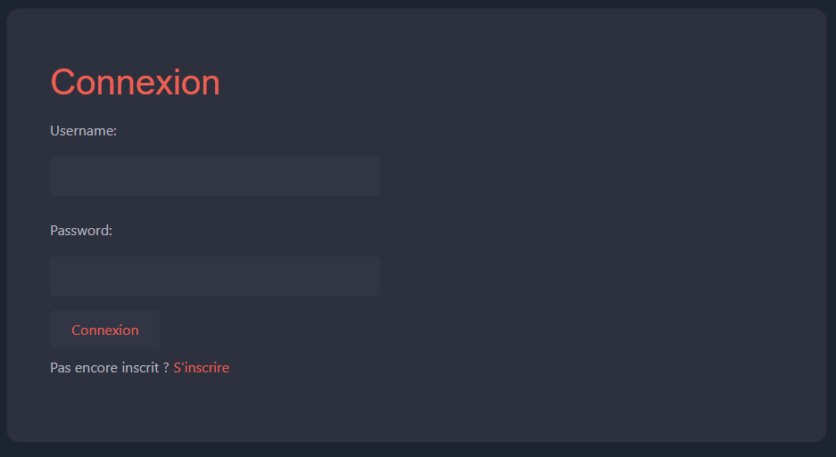
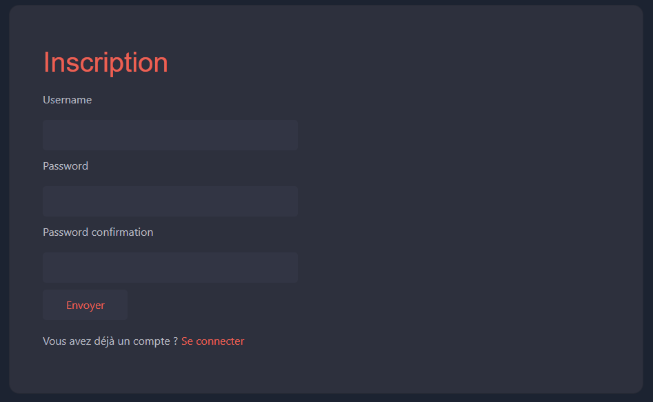
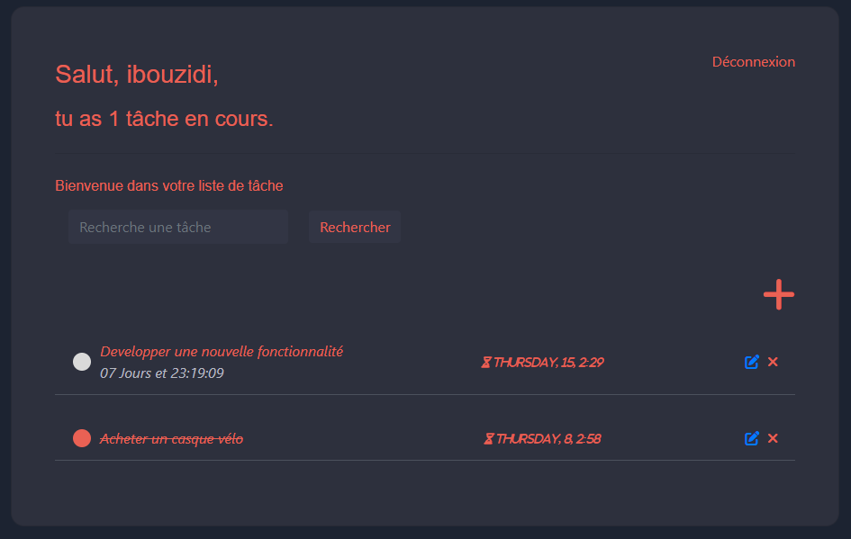
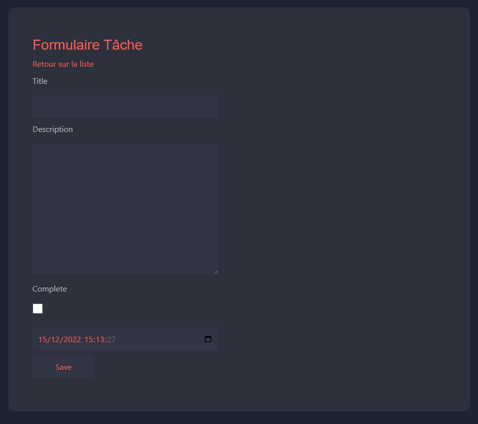

# TODO Task App - Django

This is a simple todo app that uses bootstrap and Django as backend Framework.

### This app contains: 
<ul>
<li>Sign in and sign up using generic authentication provided by Django</li>
<li>Dashboard with the list of all tasks per user</li>
<li>Full C.R.U.D task (todo item), user can create, edit, show and delete a Task using generic Django View</li>
<li>A count of all task in progress</li>
<li>A form search for researching a specific task</li>
<li>Timer in Jquery shown a countdown of the due date</li>
<li>this one only appears</li>
<li>When a task is completed, this one is crossed out.</li>
</ul>

### Setup
1. Clone this repository: <pre> git clone https://github.com/ibouzidi/dj_todolistapp.git </pre>
2. Install requirements : <pre> pip install -r requirements.txt</pre>
3. Migrate database : <pre>python manage.py migrate</pre>
4. Run server : <pre>python manage.py runserver</pre>

### Setup admin
1. Create super user: <pre>python manage.py createsuperuser</pre>
2. Access Aadmin page with super user login and password.

### Load data
1. Go to app/fixtures and add your tasks preference.
2. Load these data with : <pre>python manage.py loaddata app_tasks</pre>

<h3>Preview</h3>

